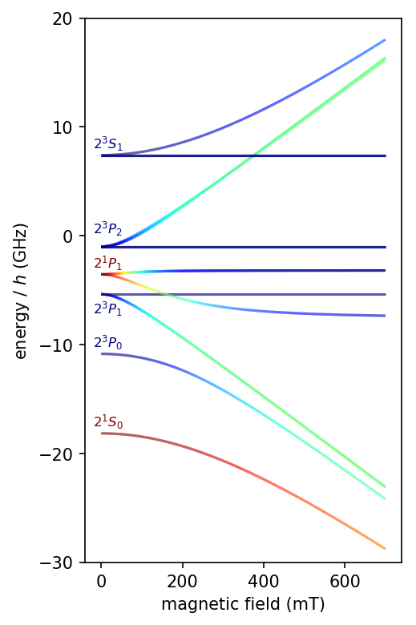
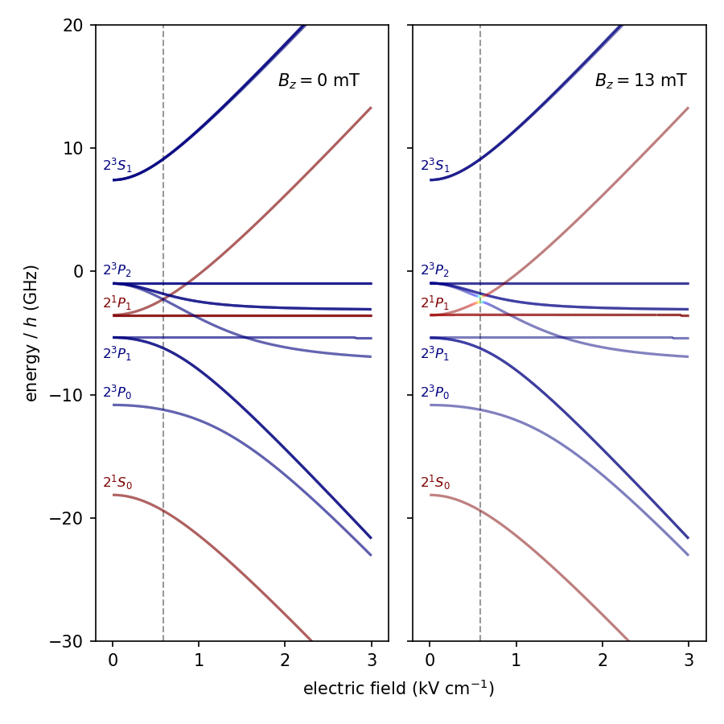
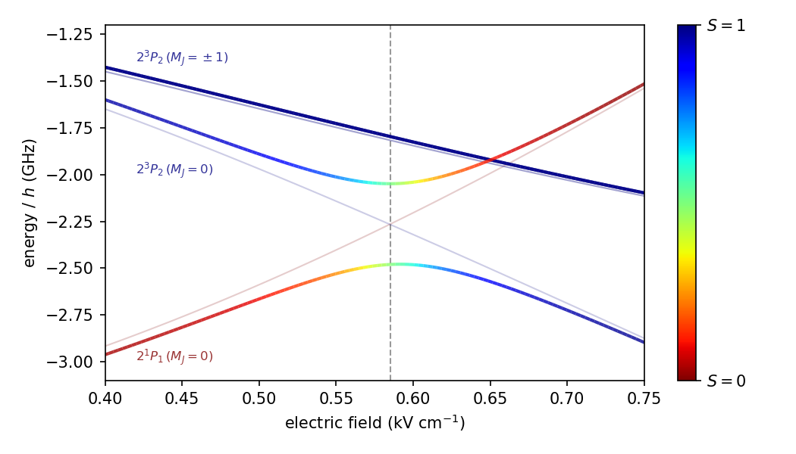
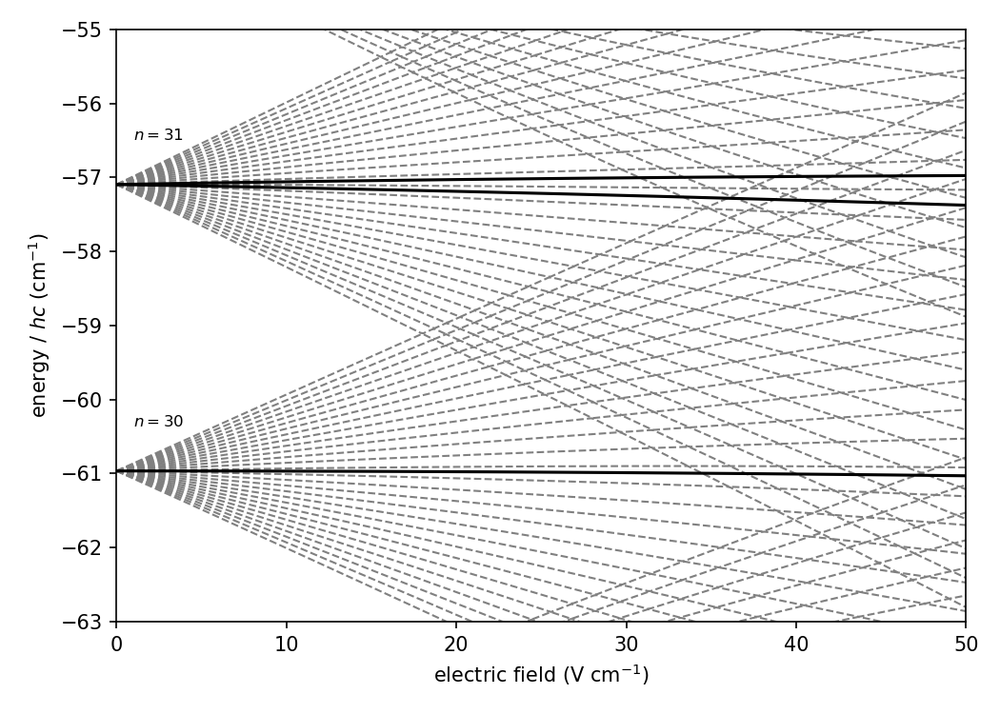

Positronium
===========

v0.0.1

Calculate the energy levels of positronium in parallel electric and magnetic fields.

Fine structure is included to first order using the formula given on page 117 of:

  | Quantum Mechanics of One- And Two-Electron Atoms  
  | by Hans a. Bethe and Edwin E. Salpeter  
  | ISBN 978-1-61427-622-7

The Stark and Zeeman matrices are constructed using the equations given in:

  | A. M. Alonso et al., Phys. Rev. A, 93, 012506 (2016) 
  | https://dx.doi.org/10.1103/PhysRevA.93.012506

Radial wavefunctions are obtained using the Numerov method, as described by:

  | M. L. Zimmerman et al., Phys. Rev. A, 20, 2251 (1979)
  | https://dx.doi.org/10.1103/PhysRevA.20.2251

Install
-------

Using `anaconda <https://anaconda.org/>`_, the main requirements can be installed with conda:

.. code-block:: bash

   conda install scipy sympy numba

Then install psfs using setuptools (this will also install `attrs <http://www.attrs.org/>`_ and `tqdm <https://github.com/tqdm/tqdm>`_).

.. code-block:: bash

   git clone https://github.com/ad3ller/psfs
   cd ./psfs
   python setup.py install

The package can now be imported into python.  

Basic Usage
-----------

The goal is to diagonalise the total Hamiltonian

.. math::
    \hat{H} = \hat{H}_{0} + \hat{H}_{S} + \hat{H}_{Z}
   
in a given field configuration, where the basis set is a list of instances of an 
attrs class called State, each element of which represents
:math:`| \, n \, \ell \, S \, J \, M_J \rangle`.  The basis is constructed as shown below.

.. code:: ipython3

    from psfs import Hamiltonian
    mat = Hamiltonian(n_min=1, n_max=3, MJ_max=None)
    print('number of basis states:', '%d'%mat.num_states)

.. parsed-literal::

    number of basis states: 56
    

.. code:: ipython3

    print(mat.basis[0])

.. parsed-literal::

    State(n=1, l=0, S=0, J=0, MJ=0)

Here, the object `mat` is an instance of the Hamiltonian class, which has methods that include `stark_map()`
and `zeeman_map()`. These can be used to calculate the energy eigenvalues using the initialised basis
in a range of electric or magnetic fields.

The accuracy of the results depends on the suitability of the basis set.  See the notebooks for examples.
The notebooks require https://github.com/ad3ller/Stark-map-tools.

Version information
-------------------

===================  =======================================
Python               3.6.1 64bit [MSC v.1900 64 bit (AMD64)]
IPython              5.3.0
OS                   Windows 10 10.0.15063 SP0
attr                 17.2.0
matplotlib           2.0.2
numba                0.33.0
numpy                1.12.1
scipy                0.19.0
sympy                1.0
tabulate             0.8.1
tqdm                 4.15.0
version_information  1.0.3
===================  =======================================

Examples
--------

This code has not been tested extensively.  But several published calculations have been successfully reproduced.

S\. M. Curry, *Phys. Rev. A*, **7** (2), 447 (1973) https://dx.doi.org/10.1103/PhysRevA.7.447

   
   **Fig. 2** Pure Zeeman effect in the first excited states of positronium.

A\. M. Alonso *et al.*, *Phys. Rev. A*, **93**, 012506 (2016) https://dx.doi.org/10.1103/PhysRevA.93.012506
 

   
   **Fig. 6 a) & b)** Dependence of the relative energies of all n=2 eigenstates in Ps on electric-field strength (a) in the absence of a magnetic field and (b) in a parallel magnetic field of B=130 G.
   

   
   **Fig. 6 c)** An expanded view of the avoided crossing.

G\. Dufour *et al.*, *Adv. High En. Phys.*, **2015**, 379642 (2015) https://dx.doi.org/10.1155/2015/379642

   **Fig. 11**: Stark states of n=30 and 31 states of Ps, with m=2 (grey dashed) and m=29 (black). In the n=30 level, the m=29 state is a circular state and experiences no first-order Stark shift and only a very weak second-order shift, as explained in the text.
